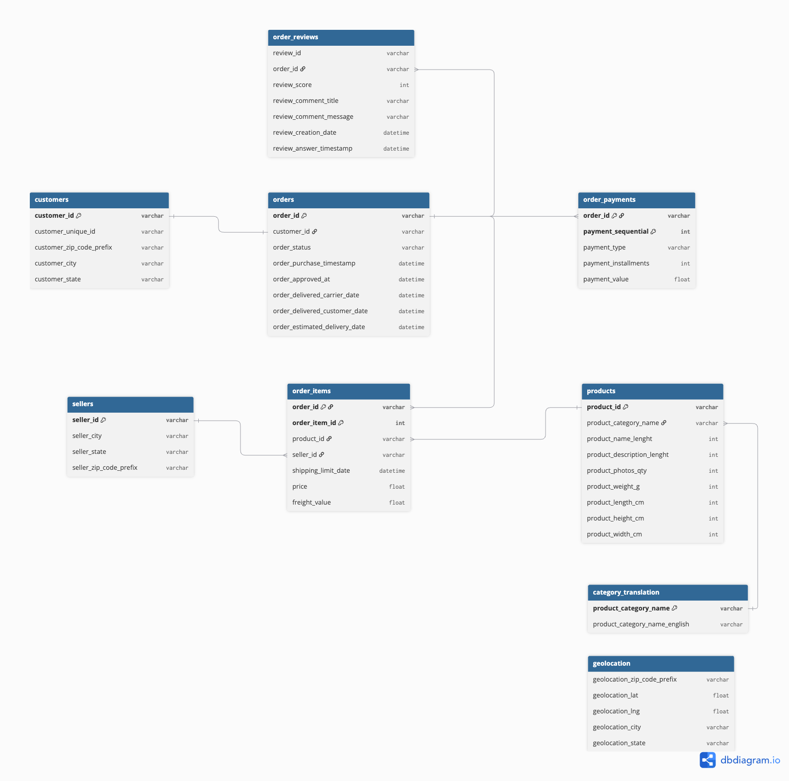

## 資料理解框架
    0. 目的與結論
    1. 資料表與關聯盤點
    2. 欄位盤點
    3. NULL檢查
    4. 關聯檢查
    5. ERD圖
    6. 訂單生命週期邏輯檢查
    7. order_event定義問題 
    8. 其他
---
### 0. 目的與結論
本報告旨在評估 Olist 資料集是否足以支援後續資料倉儲建構與顧客留存分析，並識別可能影響分析結果正確性的資料品質問題。

本專案後續以 `order_status = 'delivered'` 定義已完成購買的訂單範圍，並以 `order_event` 作為顧客單次購買行為的分析粒度。

經檢查，資料整體完整性與關聯完整性良好。雖然存在少量欄位缺失、時間邏輯異常及特殊關聯情況，但問題比例較低且已制定相應處理規則。因此，經清理與轉換後，本資料集足以支援後續顧客留存分析。  

---
### 1. 資料表盤點

| 資料表名稱 | Grain (單列定義) | 代理鍵組合 | 備註 |
| --- | --- | --- | --- |
| orders | 一筆訂單 | `order_id` | - |
| order_items | 訂單中的一個商品明細 | `order_id`, `order_item_id` | - |
| order_reviews | 一筆評論與訂單的對應記錄 | `review_id`, `order_id` | 多對多關係 (一筆審核可對應多筆訂單，一筆訂單可有多筆評論) |
| order_payments | 訂單的一個付款紀錄 | `order_id`, `payment_sequential `| - |
| customer | 訂單的客戶資訊快照 | `customer_id` | - |
| sellers | 一個賣家資訊 | `seller_id`| - |
| products | 一個產品資訊 | `product_id` | - |
| category_translation | 產品類別的英文翻譯 | `product_category_name` | - |

---
### 2.欄位盤點
    orders:
        - order_id: 訂單識別鍵
        - customer_id: 顧客識別鍵
        - order_status: 訂單狀態
        - order_purchase_timestamp: 訂單下單時間
        - order_approved_at: 訂單審核時間
        - order_delivered_carrier_date: 訂單抵達物流商時間
        - order_delivered_customer_date: 訂單送達顧客指定地點時間
        - order_estimated_delivery_date: 訂單預估送達時間
  

    order_items:
        - order_id: 訂單識別鍵
        - order_item_id: 訂單商品序號(由1開始遞增)
        - product_id: 產品識別鍵
        - seller_id:  賣家識別鍵
        - shipping_limit_date: 商品交給物流商的最晚期限
        - price: 商品價格
        - freight_value: 商品運費
   

    order_reviews:
        - review_id: 評論識別鍵
        - order_id: 訂單識別鍵
        - review_score: 評論星等(1-5)
        - review_comment_title: 評論標題
        - review_comment_message: 評論內容
        - review_creation_date: Olist 將滿意度問卷寄給顧客的日期
        - review_answer_timestamp: 顧客實際填完並提交問卷、評分或評論的時間

    order_payments:
        - order_id: 訂單識別鍵
        - payment_sequential: 付款序號(由1開始遞增)
        - payment_type: 付款方法
        - payment_installments: 分期期數
        - payment_value: 付款金額

    customer:
        - customer_id: 顧客資訊快照識別鍵
        - customer_unique_id: 顧客識別鍵
        - customer_zip_code_prefix: 顧客郵遞區號(前五碼)
        - customer_city: 顧客市
        - customer_state: 顧客洲

    sellers:
        - seller_id: 賣家識別鍵
        - seller_city: 賣家市
        - seller_state: 賣家洲
        - seller_zip_code_prefix: 賣家郵遞區號(前五碼)
  
    products:
        - product_id: 商品識別鍵
        - product_category_name: 商品類別名稱(葡萄牙文)
        - prodcut_name_lenght: 商品名稱長度
        - product_description_length: 商品描述長度
        - product_photo_qty: 商品照片數量
        - prodcut_weight_g: 商品重量
        - product_length_cm: 商品長度
        - product_height_cm: 商品高度
        - product_width_cm: 商品寬度

    category_translation:
        - product_category_name: 商品類別名稱(葡萄牙文)
        - product_category_name_english: 商品類別名稱(英文)
  
將原始csv資料匯入olist_staging資料庫，並且給予前綴stg_名稱，全部的欄位都匯入text型態
---
### 3. NULL檢查
| 資料表            | 欄位                              |    總列數 |   缺失筆數 |    缺失率 | 判定                               |
| -------------- | ------------------------------- | -----: | -----: | -----: | -------------------------------- |
| `stg_orders`   | `order_delivered_carrier_date`  | 99,441 |  1,783 |  1.79% | 可能與訂單狀態有關，需按 order_status 檢查   |
| `stg_orders`   | `order_approved_at `            | 99,441 |    160 |  0.16% | 可能為未核准或取消訂單，需按 order_status 檢查 |
| `stg_reviews`  | `review_comment_title`         | 99,224 | 87,656 | 88.34% | 選填文字欄位，屬合理缺失                     |
| `stg_reviews`  | `review_comment_message`        | 99,224 | 58,247 | 58.70% | 選填文字欄位，屬合理缺失                     |
| `stg_orders`   | `order_delivered_customer_date` | 99,441 |  2,965 |  2.98% | 可能與訂單狀態有關，需按 order_status 檢查   |
| `stg_products` | `product_category_name`及對應的產品描述長度、產品本身長度、產品照片數                    | 32,951 |    610 |  1.85% | 產品資訊不完整，需制定補值規則                  |
| `stg_products` | `產品尺寸與重量欄位`                      | 32,951 |      2 |  0.01% | 缺失比例極低，可於清理階段處理                  |

---

### 4. 關聯檢查

**檢查方法**
  - PK或者代理鍵: 必須唯一
  - FK: 必須有PK對應
  - 檢查表之間的多重性: (1:N ; 1:1 ; M:N )
  - reviews和orders的特殊關聯邏輯

**PK檢查**
| 資料表                        | 候選主鍵                            |     總列數 |   唯一值組數 | 檢查結果             |
| -------------------------- | ------------------------------- | ------: | ------: | ---------------- |
| `stg_category_translation` | `product_category_name`         |      71 |      71 | 唯一        |
| `stg_customers`            | `customer_id`                   |  99,441 |  99,441 | 唯一        |
| `stg_order_items`          | `order_id + order_item_id`      | 112,650 | 112,650 | 複合欄位唯一   |
| `stg_orders`               | `order_id`                      |  99,441 |  99,441 | 唯一      |
| `stg_payments`             | `order_id + payment_sequential` | 103,886 | 103,886 | 複合欄位唯一  |
| `stg_products`             | `product_id`                    |  32,951 |  32,951 | 唯一         |
| `stg_reviews`              | `review_id`                     |  99,224 |  98,410 | **不唯一，不可單獨作為主鍵** |
| `stg_sellers`              | `seller_id`                     |   3,095 |   3,095 | 唯一       |  
  

**FK檢查**
| 來源資料表 | 外鍵欄位 | 參照資料表 | 參照欄位 | 檢查筆數 | 未匹配筆數 | 檢查結果 |
|---|---|---|---|---:|---:|---|
| `stg_orders` | `customer_id` | `stg_customers` | `customer_id` | 99,441 | 0 | 關聯完整 |
| `stg_order_items` | `order_id` | `stg_orders` | `order_id` | 112,650 | 0 | 關聯完整 |
| `stg_order_items` | `product_id` | `stg_products` | `product_id` | 112,650 | 0 | 關聯完整 |
| `stg_order_items` | `seller_id` | `stg_sellers` | `seller_id` | 112,650 | 0 | 關聯完整 |
| `stg_payments` | `order_id` | `stg_orders` | `order_id` | 103,886 | 0 | 關聯完整 |
| `stg_reviews` | `order_id` | `stg_orders` | `order_id` | 99,224 | 0 | 關聯完整 |
| `stg_products` | `product_category_name` | `stg_category_translation` | `product_category_name` | 32,951 | 13 | 存在未匹配資料 |

- **產品類別翻譯的特殊情況**
  - `stg_products` 共有 610 筆產品的 `product_category_name` 原始值為 `NULL`，因此本身沒有可供翻譯的品類名稱
  - 另外有 13 筆產品的 `product_category_name` 不為 `NULL`，但無法在 `stg_category_translation` 找到翻譯對照
  - 這 13 筆產品僅涉及以下 2 種未收錄品類：
    - `pc_gamer`
    - `portateis_cozinha_e_preparadores_de_alimentos`
  - 因此後續資料清理可以手動在翻譯對照表補上這兩樣缺失的對照

- **Review 表的特殊情況**
  - **特殊關聯邏輯：** `reviews` ↔ `orders`
    - Review 資料並非單純的一筆 `order` 對應多筆 `review`。
    - 實際資料中，存在相同 `review_id` 對應多個不同 `order_id` 的情況
    - 經檢查，重複 `review_id` 的評論屬性資訊均相同，差異僅在其對應的 `order_id`。
    - 因此，`review_id` 無法單獨識別每筆評論與訂單的對應紀錄
    - 經檢查，review表的grain為 (review_id, order_id)  
    - 本專案保留 `review_id + order_id`，作為評論表的複合識別鍵

---

### 5. ERD圖

### 6. 訂單生命週期邏輯檢查
#### 6.1 order_status分佈
| 訂單狀態 | 訂單筆數 | 占比 |
|---|---:|---:|
| `delivered` | 96,478 | 97.02% |
| `shipped` | 1,107 | 1.11% |
| `canceled` | 625 | 0.63% |
| `unavailable` | 609 | 0.61% |
| `invoiced` | 314 | 0.32% |
| `processing` | 301 | 0.30% |
| `created` | 5 | 0.01% |
| `approved` | 2 | 0.00% |
| **合計** | **99,441** | **100.00%** | 
已送達訂單佔比97.02%，由於本專案主要分析已完成的實際購買行為，後續資料清理、資料倉儲、留存分析均使用`delivered`作為統一口徑

#### 6.2 delivered訂單生命週期null分佈檢查
| 生命週期欄位 | 缺失筆數 | 缺失率 |
|---|---:|---:|
| `order_approved_at` | 14 | 0.01% |
| `order_delivered_carrier_date` | 2 | 0.00% |
| `order_delivered_customer_date` | 8 | 0.01% |
delivered的訂單生命週期缺失率均不超過0.01%屬於極少數缺失，後續考慮直接補值  

#### 6.3 檢查delivered訂單訂單生命週期是否符合邏輯
- 邏輯：`purchase ≤ approved ≤ carrier ≤ customer` 且 `estimated ≥ purchase`

- 檢查方式: 首先排除delivered存在缺失的欄位，再針對時間欄位進行邏輯檢查。並且計算異常數

| 異常類型 | 異常訂單數 | 占 Delivered Order 比例（%） | 占異常訂單比例（%） |
|---|---:|---:|---:|
| `carrier_before_approval` | 1,350 | 1.3996 | 98.32 |
| `carrier_before_purchase` | 165 | 0.1711 | 12.02 |
| `customer_before_approval` | 61 | 0.0632 | 4.44 |
| `customer_before_carrier` | 23 | 0.0238 | 1.68 |  
可以看到異常邏輯都集中在 carrier_before_approval(商品送達物流商時間早於審核時間)佔比總訂單的1.4%，異常邏輯數的98.32%。一般電商流程通常是付款核准後才出貨。 少部分集中在其他邏輯錯誤。所以後續考量算出各個訂單生命週期距離order_purchase_timestamp的中位數，並且對所有邏輯錯誤訂單利用order_purchase_timestamp加對應的中位數進行校正，使其符合我所定義的訂單生命週期邏輯。  

#### 6.4 計算每個生命週期距離purchase時間的中位數並且對邏輯錯誤列進行校正

| 時間間隔類型 | 有效訂單數 | 中位數（秒） | 中位數（小時） | 中位數（天） |
|---|---:|---:|---:|---:|
| `purchase_to_approval` | 96,464 | 1,236 | 0.34 | 0.01 |
| `purchase_to_carrier` | 96,311 | 190,542 | 52.93 | 2.21 |
| `purchase_to_customer` | 96,281 | 883,629 | 245.45 | 10.23 |

#### 6.5 驗證校正後是否符合邏輯
驗證經過校正後資料的訂單生命週期是否完全符合邏輯
- 邏輯：`purchase ≤ approved ≤ carrier ≤ customer` 且 `estimated ≥ purchase` 且不可null

| Delivered Order 數量 | 生命週期有效訂單數 | 生命週期異常訂單數 |
|---:|---:|---:|
| 96,478 | 96,478 | 0 |

---

### 7. order_event定義問題

#### 7.1 每個customer的order gap分佈檢查
    - 首先篩選delivered訂單，計算每一列訂單與前一筆訂單的gap，並且列用顧客識別鍵，計算出每個顧客每列order
        前一筆order的gap，然後排除首購訂單(因為沒有gap)
    - 並且檢查gap分別落在哪些區間內  

| 訂單時間間隔 | 訂單數 | 占比（%） | 累積占比（%） |
|---|---:|---:|---:|
| 0 秒 | 267 | 8.558 | 8.56 |
| 1～60 秒 | 456 | 14.615 | 23.17 |
| 61 秒～3 分鐘 | 19 | 0.609 | 23.78 |
| 3～10 分鐘 | 41 | 1.314 | 25.10 |
| 10～60 分鐘 | 68 | 2.179 | 27.28 |
| 1～24 小時 | 71 | 2.276 | 29.55 |
| 超過 1 天 | 2,198 | 70.449 | 100.00 |

可以看到資料集存在同一個顧客，在很短的order purchase timestamp 間隔下，下單多筆order_id。  
而這些訂單可能來自於同一個購買行為，例如：
    - 同一個顧客在短時間分別向不同賣家下單
    - 平台因為拆分機制產生多筆訂單  

又因為本專案主要分析的是留存問題，如果將每個order_id當成一次獨立購買事件，去計算retention指標會導致，高估留存率的問題，所以必須思考重新定義什麼是一個order_evnet。  
並且根據上述表格，在3120筆非首購的delivered訂單間隔中，有723筆(23.17%)發生於前一筆訂單後60秒內。因此本專案將order event定義為：每位顧客在0~60秒間下單多筆order_id的情況下合併成一筆order event。     
所以後續在資料倉儲內建構map_order_to_order_event做對照表。
  
---  
### 8. 其他

檢查數值欄位是否落在合理的業務範圍內，以及特定欄位的唯一值。

#### 8.1 `order_items`

| 欄位 | 有效範圍 | 異常判斷條件 | 檢查結果 |
|---|---|---|---|
| `price` | `0 ≤ price ≤ 80,000` | `price > 80,000` | 無異常 |
| `freight_value` | `freight_value ≥ 0` | `freight_value < 0` | 無異常 |

#### 8.2 `order_reviews`

| 欄位 | 有效範圍 | 異常判斷條件 | 檢查結果 |
|---|---|---|---|
| `review_score` | `1 ≤ review_score ≤ 5` | `review_score < 1 OR review_score > 5` | 無異常 |

- `review_score` 的實際相異值：`[1, 2, 3, 4, 5]`
- 結論：所有數值均落在有效範圍內，未發現數值邏輯異常。

#### 8.3 `order_payments`  
|min_payment_value|max_payment_value|
|---|---|
|0.00|13664.08|  
  
payment_type: 
- credit_card: 信用卡(可分期)
- boleto: （巴西票據付款）類似「超商繳費單／銀行繳費單」
- vouncher: 折價券／禮品卡
- debit_card: 金融卡
- not_define: 尚未定義
  
付款方式和分期期數關係：  
| 付款方式 | 分期期數 | 紀錄數 |
|---|---:|---:|
| `boleto` | 1 | 19,784 |
| `credit_card` | 0 | 2 |
| `credit_card` | 1 | 25,455 |
| `credit_card` | 2 | 12,413 |
| `credit_card` | 3 | 10,461 |
| `credit_card` | 4 | 7,098 |
| `credit_card` | 5 | 5,239 |
| `credit_card` | 6 | 3,920 |
| `credit_card` | 7 | 1,626 |
| `credit_card` | 8 | 4,268 |
| `credit_card` | 9 | 644 |
| `credit_card` | 10 | 5,328 |
| `credit_card` | 11 | 23 |
| `credit_card` | 12 | 133 |
| `credit_card` | 13 | 16 |
| `credit_card` | 14 | 15 |
| `credit_card` | 15 | 74 |
| `credit_card` | 16 | 5 |
| `credit_card` | 17 | 8 |
| `credit_card` | 18 | 27 |
| `credit_card` | 20 | 17 |
| `credit_card` | 21 | 3 |
| `credit_card` | 22 | 1 |
| `credit_card` | 23 | 1 |
| `credit_card` | 24 | 18 |
| `debit_card` | 1 | 1,529 |
| `not_defined` | 1 | 3 |
| `voucher` | 1 | 5,775 |
信用卡分期從1~24期，並且出現了兩筆信用卡0期錯誤。  
而其他的付款方式皆為1期
---