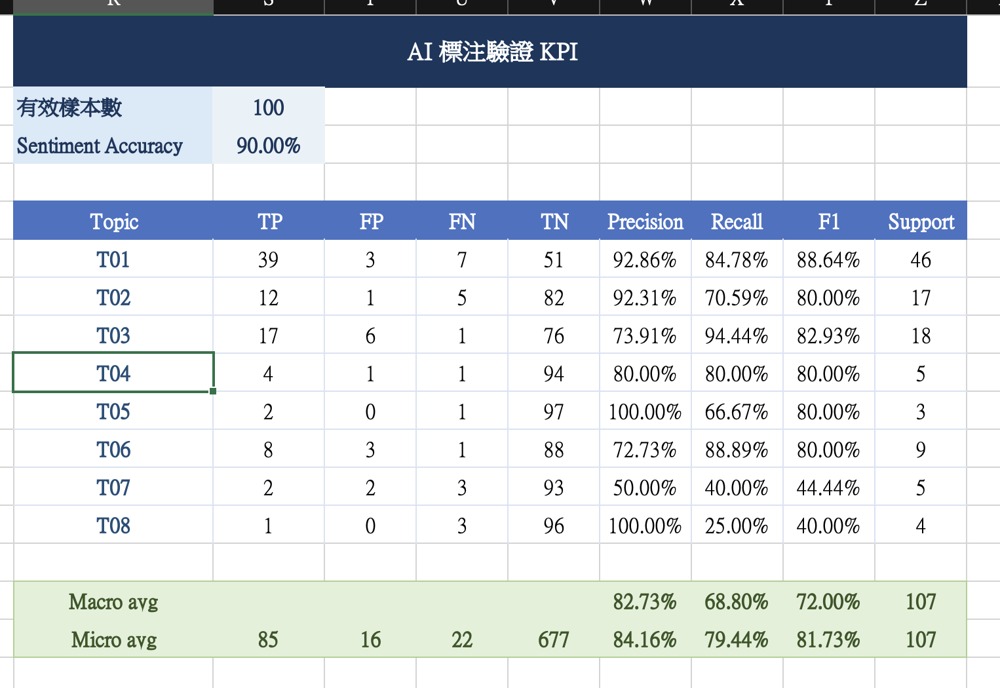

## 總結
本專案研究顧客體驗因素與 90 天二購行為之間的關聯。評論文字可能包含評分欄位無法直接呈現的配送、商品、履約、客服及交易問題，因此本流程將葡萄牙文評論轉換為兩個結構化標註面向：Sentiment 與 Topic。

本流程先從有效文字評論中依星等分層抽取 700 筆資料，透過人工閱讀與開放式標註歸納評論中的主要業務問題，並將語意相近的主題收斂為八類 Topic。接著使用 OpenAI API 進行繁體中文翻譯、Sentiment 單標籤分類及 Topic 多標籤分類。

為評估 AI 標註品質，本專案另外建立 100 筆人工標註開發驗證集，並根據錯誤案例迭代分類規則。最終 v3 在該驗證集上取得 90.00% Sentiment Accuracy 與 81.73% Topic Micro-F1。完成 1,000 筆試跑後，將相同流程應用於全部有效文字評論，最終產生 42,697 筆結構化標註，供後續顧客留存分析使用。
  
---

### 1. AI標注目的
review_score可以表達整體滿意程度，但無法說明顧客不滿的原因，例如同樣是一星評論，原因可能來自配送延遲、商品故障、訂單缺件或客服未處理。  
  
因此本專案將review_message透過結構後分類方法，轉化成可分析特徵，後續再檢驗不同體驗面向是否與顧客留存存在關聯。  
  
---

### 2. AI標注流程定義
1. 依評論星等分層抽取 700 筆評論進行人工閱讀。
2. 根據評論內容歸納並收斂為 4 類 Sentiment 與 8 類 Topic。
3. 使用 gpt-5.4-nano 進行繁體中文翻譯、Sentiment 單標籤分類及 Topic 多標籤分類。
4. 使用 100 筆人工標註資料評估結果，並根據錯誤案例迭代 Prompt。
5. 完成 1,000 筆試跑後，將流程應用於全部 42,697 筆有效評論並寫入 Data Mart。
  
---
### 3. 原始資料與處理範圍
來源表：olist_staging.stg_reviews  
識別欄位：review_id、order_id  
評分欄位：review_score  
文字欄位：review_comment_title、review_comment_message  
保留條件：標題或內文至少一者非空  
合併欄位：review_comment_title_message  
有效評論數：42697 筆  
  
**review_score沒有提供給AI模型，AI只能透過文字進行分類，以避免模型利用review_score進行推測**
  
---

### 4. 人工標注與標籤體系收斂
#### 4.1 700筆探索樣本
|  星等 | 樣本數 |
| --: | --: |
| 1 星 | 200 |
| 2 星 | 150 |
| 3 星 | 150 |
| 4 星 | 100 |
| 5 星 | 100 |
|  合計 | 700 |
  
#### 4.2 Sentiment定義原則
採用一個reivew對應一個Sentiment

| **Sentiment** | 定義 |
| --- | --- |
| positive | 評論整體表達滿意、幾乎沒有負面內容 |
| neutral | 評論主要描述事實，沒有明顯正面或負面評價 |
| mixed | 同時包含正面與負面評價 |
| negative | 評論整體表達不滿、抱怨、失望或批評，幾乎沒有正面內容 |
#### 4.3 Topice收斂原則
1. Topic定義原則
    
    採用一個review可複選多個topic機制，Topic用來辨識評論所涉及的業務面向。其在探討的問題是
    
    **顧客到底在探討哪個業務面向?**
    
    | Topic | 核心問題 | 本質 |
    | --- | --- | --- |
    | T01 配送與物流 | 顧客如何評價配送過程？ | 配送流程 |
    | T02 訂單履約 | 實際交付內容是否符合訂單內容？ | 訂單執行 |
    | T03 商品與品質 | 顧客如何評價商品本身？ | 商品品質 |
    | T04 商品資訊一致性 | 實際商品是否符合商家的「廣告、照片、商品頁描述」？ | 商品一致性 |
    | T05 包裝與保護 | 顧客如何評價包裝與保護？ | 包裝品質 |
    | T06 客服與售後 | 顧客如何評價客服或售後處理？ | 客服體驗 |
    | T07 價格與交易 | 顧客如何評價價格及付款交易？ | 價格付款 |
    | T08 平台系統 | 顧客如何評價平台功能與操作？ | 系統文件 |

#### 4.4Topic和Sentiment的關係
    
    Topic 和 Sentiment 為兩個不同的標註維度
    
    - Topic回答顧客在談什麼
    - Sentiment回答顧客整體感受如何

#### 4.5分類範例
    
| 評論範例                        | Sentiment | Topic               | 判斷理由                                            |
| --------------------------- | --------- | ------------------- | ----------------------------------------------- |
| 預定送達日期已經過了，但我到現在仍未收到商品。     | negative  | T01 配送與物流           | 明確描述未收到商品，屬於配送結果；未提到缺件、錯件或商家無法履約，因此不標記 T02。     |
| 我訂購的是紅色商品，但商家寄來了藍色商品。       | negative  | T02 訂單履約            | 實際收到的商品與顧客下單內容不同，屬於寄錯商品；沒有比較商品頁或廣告資訊，因此不標記 T04。 |
| 網站照片顯示商品是紅色，但實際收到的商品卻是藍色。   | negative  | T04 商品資訊一致性         | 實際商品與網站照片不一致；評論沒有表示商家寄錯顧客選擇的品項，因此不標記 T02。       |
| 商品到貨後完全無法使用。                | negative  | T03 商品與品質           | 明確描述商品功能異常；評論沒有提到包裝或保護不足，因此不能自行推論 T05。          |
| 包裝已經破裂且沒有任何保護，導致商品到貨時也已經損壞。 | negative  | T03 商品與品質、T05 包裝與保護 | 評論同時明確描述包裝問題與商品損壞，因此兩個 Topic 都標記。               |
| 平台結帳頁面持續顯示錯誤，但信用卡仍被重複扣款。    | negative  | T07 價格與交易、T08 平台系統  | 重複扣款屬於交易問題；同時明確指出平台頁面發生錯誤，因此 T07 與 T08 都標記。     |

---
  
### 5. Prompt迭代結果
#### 5.1 版本變化
| 版本 | 主要變更                    | 定位     |
| -- | ----------------------- | ------ |
| v1 | 初步 Sentiment 與 Topic 定義 | 探索性測試  |
| v2 | 補充 Topic 正負皆可標記、排除條件    | 正式開發基準 |
| v3 | 強化相似 Topic 邊界及禁止自行推論    | 最終規則   |
v1 使用不同樣本且只驗證 29 筆，所以只能當探索結果，不能和 v2、v3直接比較。  
  
#### 5.2 v2與v3變化
| 指標                    |     v2 |     v3 |       變化 |
| --------------------- | -----: | -----: | -------: |
| Sentiment Accuracy    | 87.00% | 90.00% | +3.00 pp |
| Topic Micro Precision | 74.59% | 84.16% | +9.57 pp |
| Topic Micro Recall    | 85.05% | 79.44% | −5.61 pp |
| Topic Micro-F1        | 79.48% | 81.73% | +2.25 pp |
| Topic Macro-F1        | 70.99% | 72.00% | +1.01 pp |
| False Positive        |     31 |     16 |      −15 |

### 6. 評估結果

為了驗證AI標注的可靠性，本專案抽取100筆樣本進行人工標注，並將人工標注當成驗證標準。

因此分別計算每個Topic的Precision, Recall, F1-score 與 Sentiment 的Accuracy

驗證結果如下：

- Sentiment Accuracy：**90.00%**
- Topic Micro Precision：**84.16%**
- Topic Micro Recall：**79.44%**
- Topic Micro F1-score：**81.73%**
- Topic Macro F1-score：**72.00%**

其中，T01 配送與物流、T02 訂單履約、T03 商品品質，以及 T04 至 T06 等主要 Topic 的 F1-score 約為 **80% 至 89%**，顯示 AI 對主要評論主題已具備一定辨識能力。

但是T07 價格與交易及 T08 平台系統的 F1-score 分別為 **44.44%** 與 **40.00%**，表現相對較低。但這兩類在驗證樣本中的 Support 分別只有 5 筆與 4 筆，樣本數不足，因此目前結果的穩定性有限，不能直接判定 AI 對這兩類主題完全無法辨識。  
  

### 7. 分類可用性判斷
綜合驗證結果，Sentiment Accuracy 達到 **90%**，Topic 整體 Micro F1-score 達到 **81.73%**，主要高頻 Topic 的 F1-score亦多數達到 80%以上，因此本專案判斷 AI 標註結果可用於後續大規模評論分類。
  
對於 T07 與 T08 等低頻 Topic，由於驗證樣本數較少且 Recall 偏低，後續分析時應將結果視為探索性訊號，不宜單獨據此提出強結論。
  
結論：AI 分類結果已達到本專案後續分析所需的基本可用標準，可進行其餘評論資料的批次分類；低頻 Topic 的分析結果仍需保守解讀。

